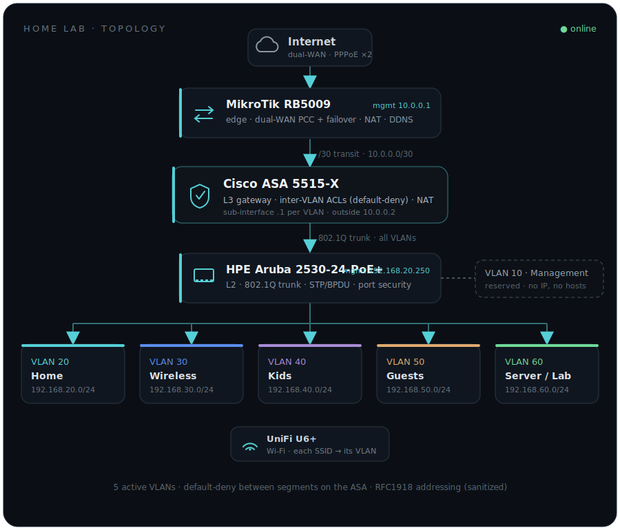

<h1 align="center">network-security-homelab</h1>

  
  
  
  

Documentation behind a real network &amp; security home lab I built, run, and learn on. The **networking is production-style and runs my home for real**. The **security / SOC stack is a deliberate learning environment** I stood up to study blue-team fundamentals — not professional or production experience.

I'm **Mihail Pascal**, a career-changer moving from ~9 years in web, design and client delivery into network and security operations. **CCNA Certified (200-301).** I learn by doing, so I built this on real enterprise gear and rebuild it constantly. This repo is the sanitized documentation of what's actually running.

## At a glance

`5 VLANs` · `3 network devices` · `~12 monitored nodes` · `open-source SOC stack`

## Topology (overview)

Full text topology, addressing and traffic flow: [`topology/`](topology/README.md)

## VLANs

| VLAN | Name | Subnet | Purpose | Trust |
|------|------|--------|---------|-------|
| 20 | Home / MikeNetwork | 192.168.20.0/24 | Trusted personal devices | Highest |
| 30 | Wireless | 192.168.30.0/24 | General Wi-Fi clients, internet-only | Low |
| 40 | Kids | 192.168.40.0/24 | Restricted, content-filtered | Low |
| 50 | Guests | 192.168.50.0/24 | Internet-only, isolated | Untrusted |
| 60 | Server / Lab | 192.168.60.0/24 | Proxmox + SOC stack + EVE-NG (static) | Restricted |

Inter-VLAN policy on the ASA is **default-deny** with explicit, logged exceptions. Each segment has its own named ACL (`home_access`, `wireless_access`, `Server_VLAN_access_in`, …). There is no blanket `permit ip any any`.

A management VLAN (**10**) is also **defined** on the switch and reserved for device
management, but is **not yet populated** — management currently runs over VLAN 20,
and migrating it is a planned hardening step. It has no IP or hosts and isn’t counted
among the five active segments above.

## Repo map

| Path | What's in it |
|------|--------------|
| [`topology/`](topology/README.md) | Text topology, addressing table, traffic flow |
| [`network/vlans.md`](network/vlans.md) | The five VLANs — purpose and security posture |
| [`network/asa-notes.md`](network/asa-notes.md) | Cisco ASA — L3 gateway, inter-VLAN ACLs, NAT, hardening |
| [`network/mikrotik-notes.md`](network/mikrotik-notes.md) | MikroTik edge — dual-WAN PCC + failover, NAT, DNS, hardening |
| [`network/aruba-notes.md`](network/aruba-notes.md) | HPE Aruba — 802.1Q trunk, STP/BPDU, port security, SSH-only |
| [`soc-stack/`](soc-stack/README.md) | Wazuh, Suricata, Velociraptor, TheHive+Cortex, AdGuard (learning) |
| [`monitoring/`](monitoring/README.md) | Zabbix — monitored nodes, metrics, alerting |

## What I can demonstrate

- **Dual-WAN** with PCC load-balancing and automatic failover (MikroTik)
- **Inter-VLAN segmentation** with default-deny ACLs and logging (Cisco ASA)
- **L2 hardening** (Aruba): 802.1Q trunking, edge-port security (static MAC, shut on violation), STP BPDU protection with auto-recovery, unused ports disabled, management restricted via `authorized-managers`, SSH-only
- **SIEM / IDS / EDR fundamentals** in a lab: log collection and correlation (Wazuh), network detection (Suricata), endpoint hunts (Velociraptor)
- **Network-wide DNS filtering** (AdGuard Home)
- **Infrastructure monitoring and alerting** (Zabbix)

## Write-ups

I document the build and the lessons at **[mihailpascal.com](https://mihailpascal.com)**:

- [Why I split my home network into five VLANs](https://mihailpascal.com/articles/vlan-segmentation) — segmentation, default-deny, and what it buys you
- [Configuring the Cisco ASA from scratch](https://mihailpascal.com/articles/cisco-asa-from-scratch) — ACLs, NAT order, and the mistakes I made
- [Building a home SOC lab](https://mihailpascal.com/articles/home-soc-lab) — how Wazuh, Suricata, Velociraptor and TheHive fit together

## Contact

- **Site:** [mihailpascal.com](https://mihailpascal.com)
- **LinkedIn:** [mihail-pascal](https://linkedin.com/in/mihail-pascal)
- **Email:** pascalmihail@gmail.com
- **GitHub:** [MikeDash-Net](https://github.com/MikeDash-Net)

## OPSEC note

This documentation is sanitized. Public IPs, credentials, API tokens, keys, device serial numbers and the WireGuard endpoint are omitted. Only RFC1918 internal addressing (`192.168.x`, `10.0.0.x` transit) appears — the same addressing already published on my site.

## License

[MIT](LICENSE).
