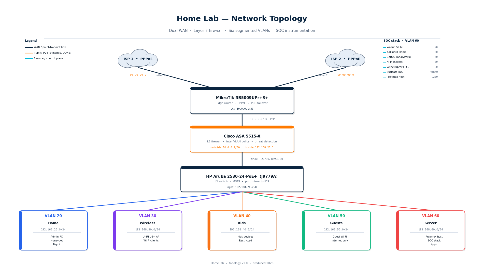

# Network & Security Home Lab

> A real, segmented, monitored home network — built and operated end-to-end.
> Three network devices, six VLANs, eleven LXC services, and a full open-source
> SOC stack instrumenting the Server VLAN.

---

## Why this lab exists

I am a career-changer targeting **NOC, SOC L1, and Junior Network Security**
roles. Reading about firewalls is not the same as running one. So I built and
operate a physical home network engineered around the patterns I expect to
touch on day one: dual-WAN with PCC load-balance, a Cisco ASA enforcing
inter-VLAN policy, an Aruba L2 with hardened access, and a SOC stack instrumenting
the server segment.

This repo is the documentation layer behind that lab. Every device has a real
serial number behind it. Every config in `/configs/` is a sanitized export of
something running on metal in my office. Every incident in `/incidents/` is a
real outage I diagnosed end-to-end, with the symptoms I observed, the captures
I took, and the fix that resolved it.

I am studying for **CCNA**, prepping **Security+**, and looking for a team where
I can do this work full-time. If that's you — the contact details are at the bottom.

---

## At a glance

| | | | |
|---:|:---|---:|:---|
| **3** | network devices | **6** | VLANs |
| **11** | LXC services | **5+** | open-source SOC tools |
| **2** | WAN uplinks (PCC) | **2026** | rebuild generation |

---

## Topology

> Vertical hierarchy: ISPs → MikroTik (PPPoE + PCC) → Cisco ASA (L3 firewall)
> → HP Aruba (L2) → 5 client VLANs. Public IPv4 addresses are redacted as
> `XX.XX.XX.X` and managed via DDNS. See [`/topology/vlan-matrix.md`](topology/vlan-matrix.md)
> for the full inter-VLAN allow/deny matrix.

---

## Hardware inventory

| Role | Device | Model | Function |
|------|--------|-------|----------|
| Edge router | MikroTik | RB5009UPr+S+ | PPPoE x2, NAT, PCC failover |
| L3 firewall | Cisco | ASA 5515-X | Inter-VLAN policy, threat-detection |
| L2 switch | HP Aruba | 2530-24-PoE+ (J9779A) | MSTP, VLAN trunking, port mirror |
| Hypervisor | Proxmox VE 9.1 | Xeon Gold 6152, 256 GB RAM | 11 LXC containers, ZFS, vmbr0 trunk |
| Wi-Fi AP | Ubiquiti | UniFi U6+ | Multi-SSID, VLAN tagging |

Detailed quick-spec callouts and config exports live in [`/configs/`](configs/).

---

## VLAN segmentation

| VLAN | Name | Subnet | Purpose | Inter-VLAN policy |
|-----:|------|--------|---------|-------------------|
|   1 | DEFAULT | — | Native, unused | Pruned everywhere |
|  10 | MGMT | — | Switch / device mgmt | Admin host only |
|  20 | Home | 192.168.20.0/24 | Admin + trusted hosts | → Server: HTTPS + SSH |
|  30 | Wireless | 192.168.30.0/24 | Wi-Fi end users | → Internet only |
|  40 | Kids | 192.168.40.0/24 | Restricted devices | → DNS only |
|  50 | Guests | 192.168.50.0/24 | Visitor Wi-Fi | → Internet only |
|  60 | Server | 192.168.60.0/24 | Hypervisor + SOC apps | Inbound from Home only |

Full ACL with line-by-line commentary: [`/policy/inter-vlan-acl.md`](policy/inter-vlan-acl.md)

---

## Repository map

| Folder | What's inside |
|--------|---------------|
| [`/topology/`](topology/) | Network diagram and VLAN allow/deny matrix |
| [`/configs/`](configs/) | Sanitized device configs (ASA, MikroTik, Aruba) — public IPs redacted, secrets stripped |
| [`/runbooks/`](runbooks/) | Step-by-step procedures: failover test, IDS tuning, agent enrollment, backup, port mirror |
| [`/incidents/`](incidents/) | Post-mortems for real outages I diagnosed |
| [`/soc-stack/`](soc-stack/) | Wazuh, Suricata, Velociraptor, AdGuard, Cortex deployment notes |
| [`/policy/`](policy/) | Inter-VLAN ACL and three-layer hardening checklist |

---

## Incidents resolved in-lab

Real outages, diagnosed and documented end-to-end. Each one is a 5–10 minute
read with symptoms, captures, root cause, fix, and lessons.

| Date | Component | Headline |
|------|-----------|----------|
| 2026-04-22 | Cisco ASA | [Hardware port `ether1` RX-failed — diagnosed via switch mirror, migrated PPPoE to `ether4`](incidents/2026-04-22-asa-ether1-rx-failed.md) |
| 2026-04-22 | MikroTik | [ISP1 PPPoE auth loop — captured PADI/PADO at L2, ISP fixed account on their BRAS](incidents/2026-04-22-mikrotik-pppoe-auth-loop.md) |
| 2026-04-26 | Proxmox | [Kernel 6.17 GPU regression killed local console — applied `nomodeset`, pinned kernel](incidents/2026-04-26-proxmox-kernel-gpu-regression.md) |
| 2026-04-27 | envisionite.ro | [Total outage — DHCP lease change on backend LXC, fixed with static reservation](incidents/2026-04-27-envisionite-dhcp-outage.md) |

---

## What I can demonstrate

- Dual-WAN with per-flow load balancing (RouterOS PCC)
- L3 firewalling with named ACLs and threat-detection (Cisco ASA)
- Six-VLAN segmentation with explicit deny-by-default
- L2 hardening: BPDU protection, port mirror, SSH-only mgmt
- SIEM operations: Wazuh decoders, agent fleet, custom rules
- NIDS rule tuning: Suricata + ET Open ruleset on AF_PACKET sensor
- EDR / DFIR triage: Velociraptor VQL artifact collection
- DNS filtering with per-client logs piped back into the SIEM
- Incident response with packet-level evidence
- Runbooks under version control — the same hygiene a junior is expected to follow

---

## OPSEC notes for readers

- All public IPv4 addresses redacted as `XX.XX.XX.X`. Real values rotate via DDNS.
- All `*.cfg.example` files have passwords, shared keys, certificates, and tokens stripped.
- SSIDs and hostnames are renamed to generic placeholders (`HOME-SSID`, `IOT-SSID`, …).
- Commands and procedures are real — that is the point.

---

## Contact

- LinkedIn: [linkedin.com/in/mihail-pascal](https://linkedin.com/in/mihail-pascal)
- E-mail: pascalmihail@gmail.com
- GitHub: [github.com/MikeDash-Net](https://github.com/MikeDash-Net)

---

Mihail Pascal · v1.0 · 2026 · MIT License
